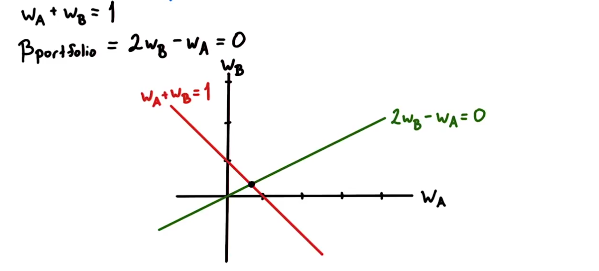
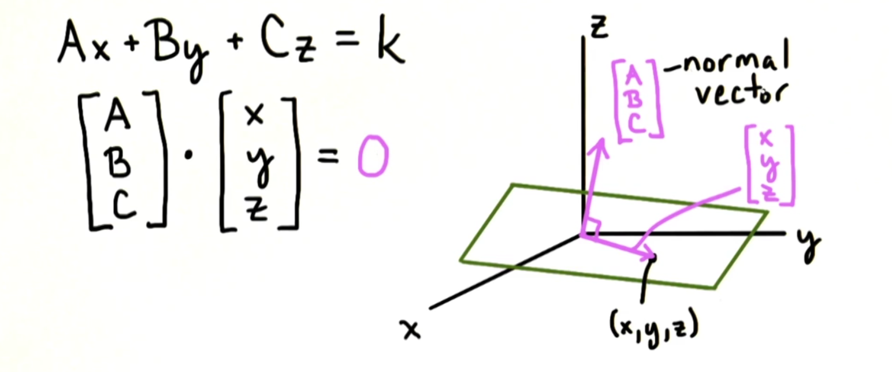
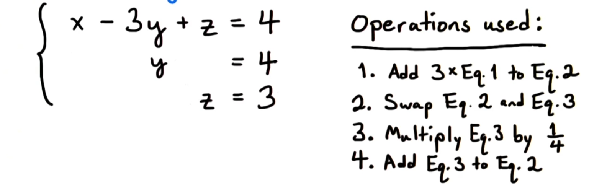
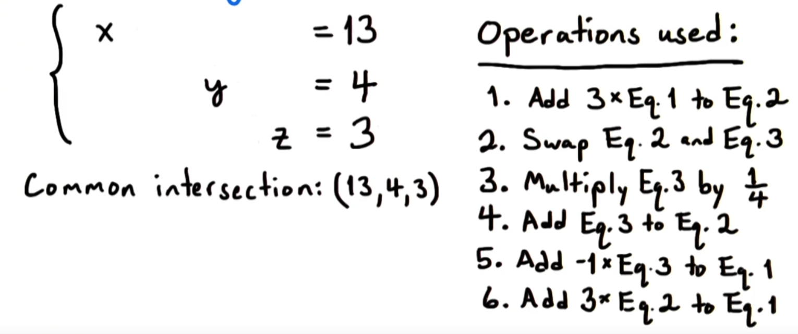
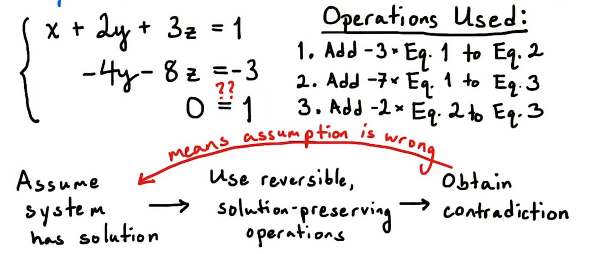

# Intersection Notes

- [Why_intersections?](#why_intersections)
- [Lines_in_Two_Dimensions](#lines_in_two_dimensions)
- [More_Than_Two_Lines_in_Two_Dimensions](#more_than_two_lines_in_two_dimensions)
- [Planes_in_Three_Dimensions](#planes_in_three_dimensions)
- [Intersection_of_Planes_in_3D](#intersection_of_planes_in_3d)
- [Rules_for_Manipulating_Equations](#rules_for_manipulating_equations)
- [Solving_a_System_of_Linear_Equations](#solving_a_system_of_linear_equations)
- [Special_Cases_in_Gaussian_Elimination](#special_cases_in_gaussian_elimination)
-[Summary](#summary)

## Why_Intersections?

Equations come from observed or modeled relationships between real-world quantities.

Beta = 1 - Stock perfectly correlated to market
Beta = 0 - Stock completely uncorrelated to market
Beta = -1 - Stock perfectly negatively correlated to market

Beta(portfolio) is a weighted average of the stocks in the portfolio)
- therefore Wa + Wb = 1

To minimize market risk we want a Beta value for our portfolio to equal Zero

Finding the intersection between these 2 linear relationships shows us the weights that will give our portfolio a beta value of Zero and minimum market risk.

Solving systems of equations:
- Economics
- Biology
- Chemistry
- Physics
- Engineering
- Computer Science

## Lines_in_Two_Dimensions

A given line has infinite base points (any point on the line) and direction vectors (can multiply by non-zero scalar and will remain on same line)

A more general equation to represent a line:

Direction Vector

Changing k shifts the line off the origin

## More_Than_Two_Lines_in_Two_Dimensions

Common Intersection

More Common is individual intersections for each line

## Planes_in_Three_Dimensions

Equation as the dot product of two vectors

Changing k shifts the vector but does not change direction--just like in 2D.

Vector [A, B, C] is the normal vector (orthogonal) to the plane.  If 2 planes have the same normal vector then they are parallel.

## Intersection_of_Planes_in_3D

Two intersecting planes intersection will be a line.  The cross product of the two normal vectors will not be zero because they are not parallel and it will be orthogonal to both.

Pick an arbitrary point on intersection line (x0)

Consequences of this:

With introduction of 3rd plane

## Rules_for_Manipulating_Equations

With 3 planes the algebra gets crazy!  And will become less generalizable to higher dimensions.

Algorithm for solving system of linear system:

If we add the 2 equations the we can deduce that the solution is preserved and the intersection will remain the same.  It will keep all previous points and will not contain any new points.  

Can also add a multiple (or an arbitrary amount) of one equation to another.

## Solving_a_System_of_Linear_Equations

Build a procedure to reduce a system of equations to as simple a form as possible. Ideally, finding the unique solution to a system if it exists.

**Gaussian Elimination Algorithm**

Procedure:

Use operations to reduce variables in system of equations so that there is one less variable in each equation.

Operations Reminder:
- Swap order of equations
- Multiply an equation by a non-zero number
- Add a multiple of an equation to another

Notice the triangular form of the system.  The leading variable does not appear in subsequent equations.

Note: This manipulated system does **not** represent **the same planes** as the original system **but** it does represent the **same solution set**.  We have changed the system such that the common intersections remain the same.

Once we have reached triangular form we clear upwards.  In this example we solve for z then y then x.

Solve for z:

Solve for y:

Solve for x to get common intersection point:

Check to see that solution solves original system

Run through process again with plot to demonstrate transformations occurring with each operation.

**Practice**

## Special_Cases_in_Gaussian_Elimination

**No Solution:**

This contradiction tells us that the system has no solution.

**Multiple Solutions**

The system would have the same solution if we dropped the last equation all together.

To solve this we can **parametrize** the solution set (like we did for lines).

In the example above, once we remove the 3rd equation, see that we cannot clear terms downwards anymore.

Instead, we will identify a **pivot variable**--a variable that is a leading term when the system is in triangular form. In this case **x** and **y** are the leading variables (since they are in the front of the equations).

Since **z** is not a leading variable in any of the equations it is a **free variable**.  Therefore, it will become a parameter in the parametrization of a solution set.

If we pick points for z we will find points for x and y that will solve the system from our parametrization.

**More Practice**

No Solution:

Unique Solution:

Infinite Solutions:

Systems with No Solutions:

Systems with One Solution:

Systems with Many Solutions:

**Summary of Characterization Results**
1. A system is inconsistent if we find 0=k for k non-zero during Gaussian Elimination.
2. Not enough to count the number of equations (usually) or look for 0=0 to determine if infinitely many solutions.
3. A consistent system has a unique solution if each variable is a pivot variable.
4. The number of free variables equals the dimension of the solution set.

## Summary

- Geometry and algebra are both important parts of solving systems of equations.
- Gaussian elimination exploits geometric insight to give us a procedure for finding an algebraic solution to a system.
- Next Step: Looking at systems of equations form a new perspective.  As statements about transformations of space.
