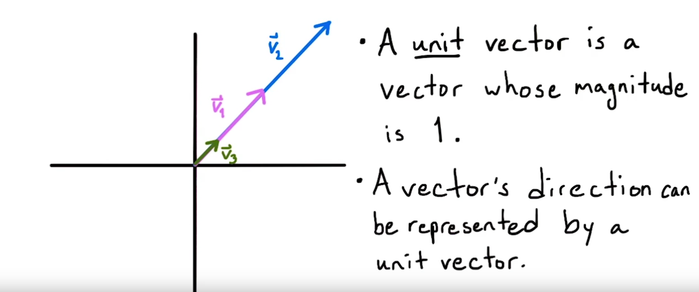

# Vector Notes

- [Addition](#addition)
- [Subtraction](#subtraction)
- [Scalar_Multiplication](#scalar_multiplication)
- [Magnitude_and_Direction](#magnitude_and_direction)
- [Dot_Product](#dot_product)
- [Parallel_and_Orthogonal_Vectors](#parallel_and_orthogonal_vectors)
- [Projecting_Vectors](#projecting_vectors)
- [Cross_Product](#cross_product)

## Addition

## Subtraction

## Scalar_Multiplication

## Magnitude_and_Direction

Zero Vector

## Dot_Product

## Parallel_and_Orthogonal_Vectors

## Projecting_Vectors

Opposite assumption

## Cross_Product

Check answer by seeing if it is orthogonal to both v and w

